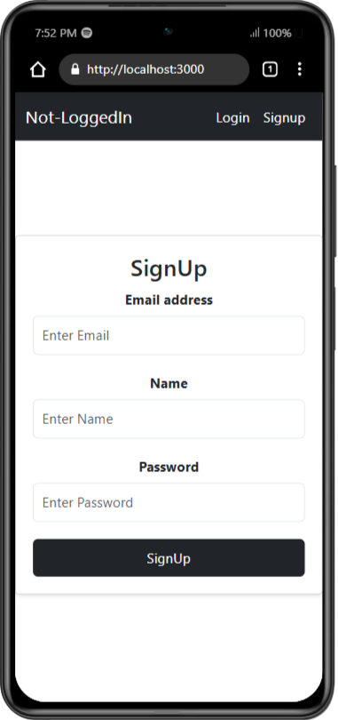

# Secure User Authentication System


## By, Subhadip Maity; 27th, Aug - 3rd, Sep 2024

## Description
This project is a secure user authentication system built with Node.js and React. It includes functionalities for user signup, login, and token-based authentication using JSON Web Tokens (JWT).
## Table of Contents
- [Installation](#installation)
- [Usage](#usage)
- [Features](#features)
- [Images](#images)
- [Technologies Used](#technologies-used)
- [Contact](#contact)

## Installation
1. Clone the repository:
    ```bash
    git clone https://github.com/SontuCoder/Authentication-System.git
    ```
2. Install dependencies:
    ```bash
    cd BackEnd
    ```

    ```bash
    npm install
    ```

    ```bash
    cd ../
    ```

    ```bash
    cd my-react-app
    ```

    ```bash
    npm install
    ```

    ##### Start the Backend Server
    ```bash
    node app.js
    ```

    ##### Start the Frontend Application
    ```brsh
    npm start
    ```

## Usage
This project provides a secure user authentication system, which can be used in various types of web applications requiring user sign-up, login, and secure access to resources. The system leverages JSON Web Tokens (JWT) for secure authentication.

## Features

- **User Signup:**  
  - Register new users with email, name, and password.

- **User Login:**  
  - Authenticate users with their credentials and issue JWT tokens.

- **Token Authentication:**  
  - Protect routes using JWT for secure access.

- **Token Refresh:**  
  - Refresh expired tokens with a refresh token mechanism.

## Images
1. Login-page
    

2. SignUp-page
    

## Technologies Used

- **Backend:**  
  - Node.js, Express, MongoDB.

- **Frontend:**  
  - React, Bootstrap.

- **Authentication:**  
  - JWT, bcrypt.


## Contact
- Email: [your.email@example.com](mailto:subhadipmaity211@gmail.com)
- GitHub: [YourUsername](https://github.com/SontuCoder)
